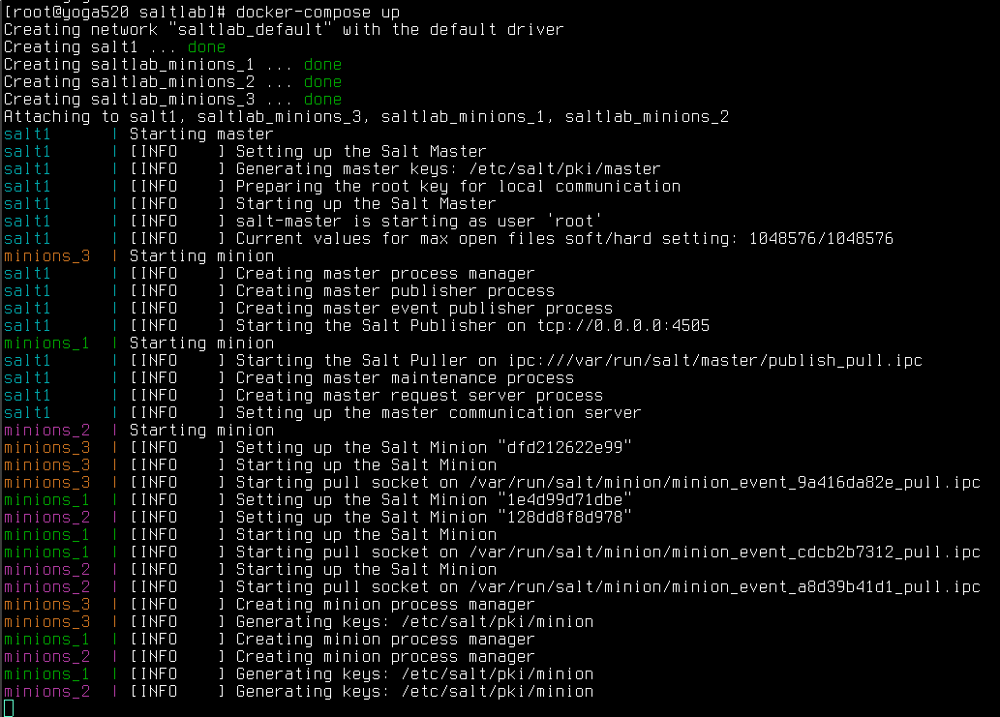

# saltlab
Personal Saltstack lab environment in Docker (Centos7 containers)
Contact: Robert Nowotniak <rnowotniak@gmail.com>

## Quick start

    git clone https://github.com/rnowotniak/saltlab
    docker pull rnowotniak/saltlab

    cd saltlab
    docker-compose up

Enter the Salt master container, accept all minions keys:

    docker exec -it salt1 bash -l
    salt-key
    salt-key -A -y

    salt '*' test.ping
    
Change number of minions dynamically:

    docker-compose up --scale minions=6

----------

## Some useful links:

* https://docs.saltstack.com/en/latest/topics/installation/rhel.html
* https://docs.docker.com/compose/gettingstarted/
* https://docs.docker.com/engine/reference/run/
* https://docs.docker.com/compose/django/

docker pull centos:centos7
docker run -it --rm centos:centos7

salt yum.repo

yum install salt-master
yum install salt-minion

vi /etc/salt/minion  (update master: hostname)

/usr/bin/salt-master -d
/usr/bin/salt-minion -d -l info

tail /var/log/salt/{master,minion}

salt-key
salt-key -A

---
docker build -t rnowotniak/saltlab .
docker run --name salt1 --rm rnowotniak/saltlab
--
docker-compose
up  ( -d )
scale minions=3
logs master
ps
restart minions

ps
run
stop

